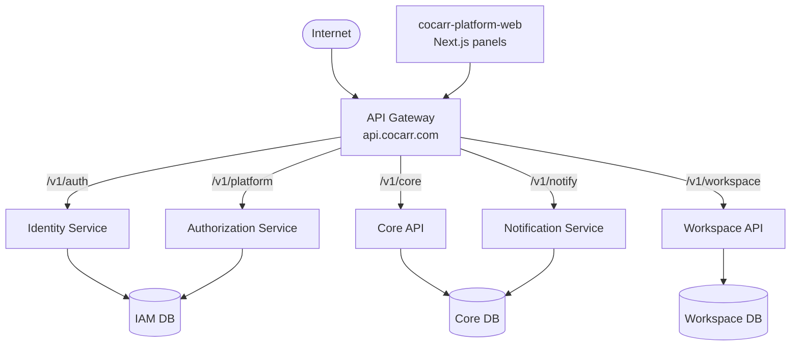

# Architecture Overview

The Cocarr platform is a service-oriented system behind a single public gateway.

## Request flow
1. A client signs in with **Firebase**, receiving an ID token.
2. It exchanges that token at the **Identity Service** (`/v1/auth/verify`) for a
   platform session + refresh token, and is mapped to a platform **identity id**.
3. Subsequent calls go through the **Gateway**, which verifies the JWT, applies
   rate limiting/CORS/logging, and proxies to the target service.
4. Services make access decisions against the **Authorization Service**
   (`/v1/authorize`) — the central IAM resolution point.

## Responsibilities
| Service | Owns | Does NOT own |
|---|---|---|
| API Gateway | JWT check, routing, rate limit, CORS, correlation ids | business logic |
| Identity | who you are: identity mapping, sessions, devices, password links | roles/permissions |
| Authorization | what you may do: taxonomy, roles, policies, delegation, resolution | authentication |
| Workspace | employees, HR, organization, onboarding | car-sharing domain |
| Core | the car-sharing business (bookings, hosts, vehicles, payments, KYC) | — |
| Notification | email/SMS/push delivery + templates | — |

## Principles
- **Reuse, don't rewrite.** Core and Web are the original production apps,
  migrated unchanged; new services are greenfield. ([ADR-0001](../adr/0001-reuse-not-rewrite.md))
- **One stack.** Node/Express + Sequelize + MySQL + Firebase everywhere (gateway
  is TypeScript). ([ADR-0005](../adr/0005-gateway-typescript.md))
- **Central IAM.** Permissions live in one service, keyed by strings like
  `workspace.employees.read`. ([ADR-0003](../adr/0003-central-iam.md))
- **Panel-per-product web.** One Next.js codebase; each product is a build-time
  panel. ([ADR-0004](../adr/0004-panel-per-product-web.md))
- **Resilient boot.** Every service listens even if its DB is down, so
  `/v1/health` can report `degraded` rather than being unreachable.
- **Dev-friendly, except at the door.** Provider integrations (email, SMS, push)
  SIMULATE when unconfigured. **Authentication never does** — it fails closed:
  the only bypass is `AUTH_DISABLED=true` *and* `NODE_ENV != production`, and a
  service with neither `GATEWAY_KEY` nor `ADMIN_SERVICE_ACCOUNT` answers 503 on
  every authenticated route rather than admitting a synthetic user.
- **One verification per request.** The gateway verifies the Firebase token, then
  forwards `x-user-id` / `x-identity-id` behind a shared `GATEWAY_KEY`. Services
  trust those headers only when the key matches, and the gateway strips any
  client-supplied copy at the edge. Without a key configured they fall back to
  verifying the bearer token themselves.
